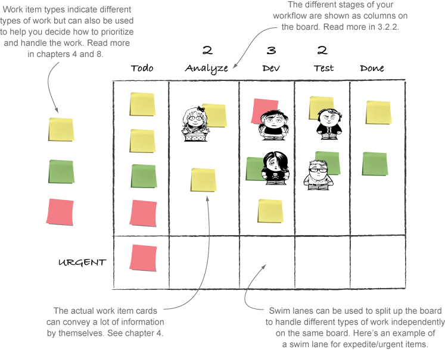

# Visualizing your work

## Making policies explicit

People make assumptions about everything.
Sometimes these assumptions are inconsistent or even conflicting.
If you can make these policies explicit the inconsistencies have to be dealt with and the conflicts can be resolved. It's much easier to hold a rational and empirical discussion about how to improve them.

The policies can , and should, be broken from time to time, but the decision to do so should be made intentionally and often with careful consideration from the whole team.

### Information radiator

Information radiators take the shape of big and visible displays or charts, are placed so that the team can always see them, but they should also be easily accessible to stakeholders outside the team.
They should be easy to keep up to date.

#### Don't hide your info in the fridge

Electronic board Pros:

- universally accessible
- no loss of data
- automatic calculation of metrics
- can store information and discussions about each item

Physical board Pros:

- generally bigger
- draws people from their desks and becomes a natural place to gather
- generally easier to set up
- easier to change and adjust to your particular needs

### Co-location? Luxury!

Maybe you and your team don't have the luxury of sitting together.
The decision to use an electronic tool or not should be left to the team.
Make sure your information is visual for everyone in the team to see.

### Can. Not. Process

Avoid information overload.

### Go big

Make sure the information is big enough to see easily from a few feet away.

### Use it or lose it

Constantly reevaluate whether you should keep the radiator as is or if you should change it in any way.

### 1+1 equals 3

When you combine the power of making policies explicit with visualization using information radiators, the policy is in your face, and it helps you do the right thing.

Information radiators:

- big, visible displays
- for you and other interested parties
- keep it easy to update
- keep it big
- use it or lose it

## The kanban board

The most common and prominent information radiator for the kanban teams is the board.

### The board

The basic board is a whiteboard or some empty wall space where you put up stickies or index cards.

- use a big board to radiate information about your work
- physical and electronic boards can serve different purposes; try to make the most out of both
- use daily standup meetings in front of the board to collaborate and learn together

### Daily standup

- decide on a recurring time. Use a meeting to begin the day together
- keep the meeting short (5 minutes max). Stand up during the meeting.
- discussions that don't involve most people are paused and moved to after the meeting

### Mapping your workflow to the board

For starters, you want to capture the actual workflow.
The team members who are going to use it should design the kanban board.
Resist the urge to improve your process here and now.

- let the board reflect your actual workflow
- learn by using real examples
- don't think too much; be prepared for changes

## Queues

Queues can help you to manage handoffs, get a more even flow of work, and give the team members visual signals that work is ready to be started.

### Entry and exit criteria

The entry and exit criteria can be captured as bullet points or as a checklist and visualized above or below the column they apply to.
We often find it useful to revisit the entry and exit criteria when something related to workflow comes up.
