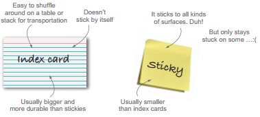
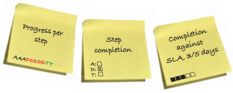
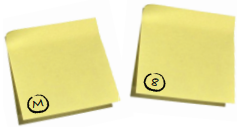
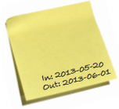
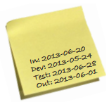
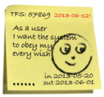

# Work Items

The most common way to track work items is to create a small card that represents the work that is being done. It can be an index card or a sticky note.

Using a physical card gives you some advantages over an electronic representation.
A physical card can easily be annotated and customized with:

- avatars
- blockers
- progress bars
- tracking IDs
- etc

By moving stickies on a board, you involve more of your senses in the process and thereby create a stronger connection between you and the work items.

## Design principles for creating your cards

The card should:

- facilitate decision making
- help to optimize output
- show the type and class of work

## Work-item cards

### Description

Keep descriptions:

- terse
- to the point
- understandable to everyone on the team

User story, title, the one where...

### Avatars

- indicates who's doing what
- should look (a bit) like the person in question
- can be used to limit WIP

### Deadlines

- indicates hard due dates for the work item
- clearly stand out from other information
- can be used to provide a timebox for the work item

### Tracking IDs

- ID in external, electronic systems
- think: "more info here" link
- ID or similar to search for in the electronic system

### Blockers

- clearly indicate that the item needs your attention
- should also indicate why
- progress bars on blockage

## Types of work

- different colors for different types of work
- helps prioritization
- avoid yellow sea
- use colors for a reason

## Progress indicators

- show "how much done" the item is
- dots, boxes, or letters
- total or per step
- base for service-level agreement

## Work item size

- how big is this work item
- relative number or T-shirt sizes
- set as it enters the board or when known

## Gathering workflow data

Workflow metrics:

- metrics for how the work flows
- could be as simple as dates for in/out on the board
- more advanced: dates / column
- keep it simple and improve as needed

Emotions:

- simply draw an icon on the sticky when you finish it

Fun practices:

- split an item in two parts (literally, with scissors) when you have concurrent activities / parallel lanes that merge together again
- use different-sized work items for different sizes of work

## Creating your own work-item cards

Team exercise:

- what information is needed for you to know what to do with the work items?
- what information may be interesting to other people who aren't working with the work items every day?
- do you have different types of work?
- do you need blockers?
