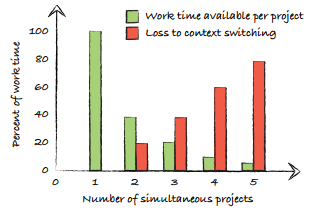
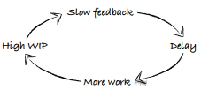

# Work in process

## Understanding WIP

### What is WIP

Work in process (= work in progress, WIP) is all the work that you have going on right now.
Limiting WIP is one of the core kanban principles, will help you complete more work in total more quickly.

#### Little's law

In queuing theory, this law explains the relationship between WIP and **lead time**:

>cycle time = WIP / Throughput

where:

- *cycle time* is the time through the process for each item
- *WIP* is the number of items you work on at the same time
- *Throughput* is average time it takes to complete each item

### What is WIP for software development

WIP in knowledge work isn't visual.

#### Specifications not being implemented yet

A specification that is written and lying around waiting to be implemented is work in your process.

#### Code that isn't integrated

is WIP

#### Untested code

is WIP.
Automated testing is one way to handle this problem.

Test-driven development (TDD) and behavior-driven development (BDD or Specification by example) are all about developing things right!

#### Code not in production

is also WIP

## Effects of too much WIP

### Context switching

One study showed that as much as 10% of your working time per project is lost to context switching.
Another study also showed that context switching represented a 10-point drop in IQ.

### Delay causes extra work

This problem boils down to the **feedback** loop being longer.
Feedback is an essential part of every agile process. Feedback is the creator of knowledge. It tells you about the quality of your work and your workflow.
The more quickly you can get feedback, the more quickly you can change a bad process into a slightly better one. So you want **to fail fast** if there are any problems.

Higher WIP causes feedback to become slower and slower. The slow feedback itself causes even more work to be created, which causes even higher WIP...

### Increased risk

With more work going on at the same time, you're increasing risk.

### More overhead

Coordination of work

### Lower quality

The quality of your code may suffer from long lead times from when you introduced the bug until you're informed of it.

### Decreased motivation

Long lead times can decrease the motivation of your team.
