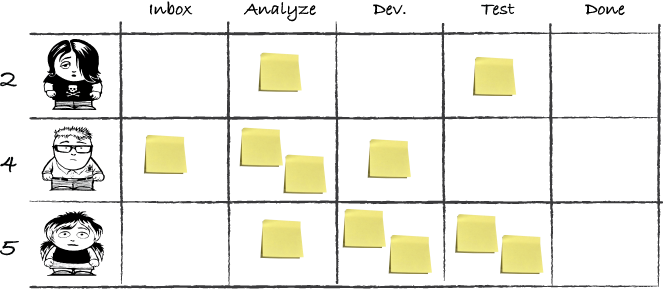

# Limiting work in process

The WIP limits can and should change.
The goal is not to limit WIP.
WIP limits are only a means to drive you to improve. Improve to achieve a better flow.

## The search for WIP limits

The WIP limit for your team depends on:

- how much pressure there is to continuously improve the organization
- the number of people on the team and their availability
- the shape and size of the work items you're working with

### Lower is better than higher

A lower WIP limit will give you better lead times and faster feedback and force you to remove impediments.
Setting the WIP limit too low, however, could make your process come to a grinding halt.

### People idle or work idle

If your WIP is too high, work will become idle.
With a WIP limit that is too low, people will become idle.

### No limits is not the answer

The risk is that you'll end up with a board flooded with work showing your inefficiencies and your failure to move work through your process.

## Principles for setting limits

### Stop starting, start finishing

Strive to complete current work before starting anything new.
It makes sure you don't increase WIP.

### One is not the answer

Unless you're doing **mob programming**.

## Whole board, whole team approach

This can be a simple way to get started: to limit the total number of work items on the board for the whole team.

### Take one! Take two!

You could start out boldly and decide on a WIP limit of one per person:

>WIP = team size * 1

That approach creates some problems; if you become blocked, you can't pick up new work without breaking the WIP limit.

It seems more reasonable to allow for a maximum of two items each:

>WIP = teams size * 2

But that setup might not be reasonable either, because it allows for situations in which every person on the team can be blocked on one item and still keep working on another without breaking the WIP limit.
In many instances this isn't pushing the team enough.

To push the team, you can:

>WIP = team size * 1.5

If all team members are now blocked on one item, you'll start to break the WIP limit if everyone picks up another one to work with.

The numbers in our examples aren't that important, but the reasoning to find your WIP limits is.

### Come together

If your team is using collaboration practices like **pair programming**, you should probably lower the WIP limit even more. In such cases, you could set the WIP limit to a number lower than the number of people in the team.

For example:

>WIP = team size / 1.5

To be able to handle this WIP limit and still engage people in the process, the team members will have to cooperate on items to finish them using pair programming, writing the specification together, or testing in pairs. As a nice side effect, the work items will move fast across the board.

### Drop down and give me 20

One technique was introduced by Don Reinerstsen is the follow: you first observe what a normal level is in an unconstrained system. Visualize the work items, and count them to learn what your current WIP is.
The double that amount of WIP and use that number as the limit.
From this new limit, you can then incrementally go down by 20-30% decrements until you start to experience problems, queues build up, or you see people idle between tasks.

This approach puts the focus on an important aspect of WIP limits; they're cheap to implement.
This makes WIP limits excellent for use in experiments.
This approach teaches the team to continuously evaluate the limit to improve the flow.

### Pick a number, and dance

Whole team WIP limits:

- a total number for the entire team
- example strategies:
  - take two
  - come together
  - double and then drop by 20% increments
  - pick a number
- change your limit as needed
- lower your WIP to improve lead times

## Limiting WIP based on columns

This gives them a bit more fine-grained control over how their workflows and an opportunity to handle bottlenecks and uneven flow.

### Start from the bottleneck

If you can identify the bottleneck in your workflow, it makes sense to use WIP limits to help resolve it.
Putting a WIP limit on the step feeding the bottleneck will stop the bottleneck from being flooded and drive behavior to resolve the bottleneck.

Example: if we have a bottleneck in the Test column we can put a WIP limit on the whole Development column:

The developers will have to stop doing Development work when the queue starts to build.
They could help the testers finish their work.

### Pick a column that will help you improve

A common scenario is to use kanban in order to collaborate together on fewer work items in order to complete them faster.

### A limited story, please

Can you limit your work in process based on estimated size of the work item, for example, by using **story points**.
Limiting WIP by estimated size means you only pull new work as long as it keeps you under an agreed-on limit: for example, under 10 story points.

This WIP-limiting approach is often more suitable to decide per column, rather than for an entire team, because the size of a work item may change the more you work with it.

### how to visualize WIP limits

Column-based WIP limits are often visualized by drawing them above each column of the board.
But variants of this are plentiful:

- boxes for each work item
- plastic folders or other physical placeholders for each allowed work-item card

What you use is up to your imagination and what suits your team.

## Limiting WIP based on people

Some teams have a situation where people take work from start to finish.
A typical example is first-line support.
This calls for another strategy: some teams choose to limit the number of work items for each person.
Another situation where limiting WIP per person is suitable is for fighting multitasking on all levels in the team.

### Common ways to limit WIP per person

#### This board isn't big enough for all these avatars

If you're using avatars to indicate who is working on what, a simple measure is to limit the number of avatars each person can have "in play" in the same time.

#### Swim in your own lane, please

Another common way to limit WIP per person is to give each person a swim lane through the process.

This approach can also be used to limit work per team on a multi-team board or for *team-lets* (parts of a team).

## Frequently asked questions

Sometimes, when WIP limits are described, they come across as something definitive; this add to the confusion, because WIP limits should be moving targets.

### Work items or tasks - what are you limiting?

Often teams split up work items into tasks for certain steps in their workflow.
Some teams even divide the columns into sub-columns, forming a mini-board for the tasks.

The team counts the WIP limit against the work item, not the tasks that compose the work item.
The tasks are only for tracking what you need to do in order to complete the work item.

### Should you count queues against the WIP limit

This choice is something that needs to be discussed with the team, but the practical function of the queue column is the same in either case: items stuck there will stand and hinder the flow, and people can't pull new work into columns before the queue.

## Exercise: WIP it, WIP it real good

Remember that the WIP limit is a tool that you can use to help you improve your work.
Strive to start simple and make your approach more advanced as you see the need.
