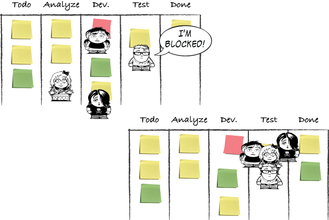
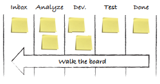
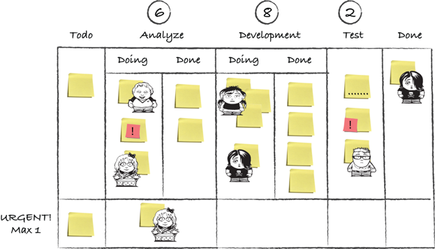
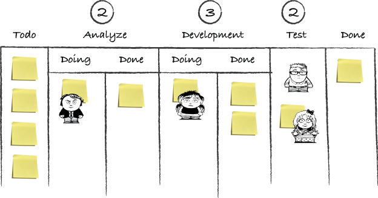
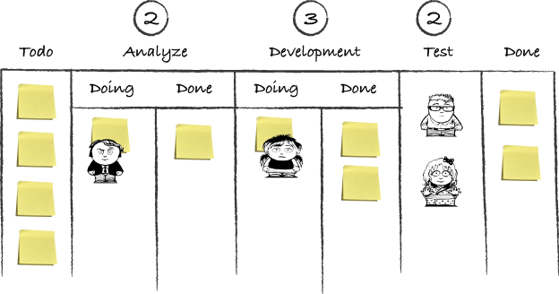
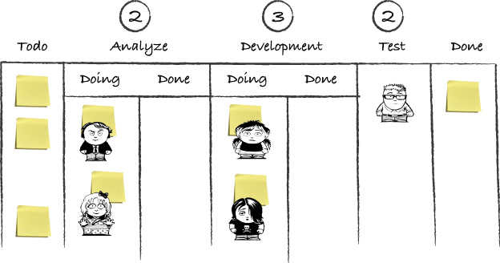
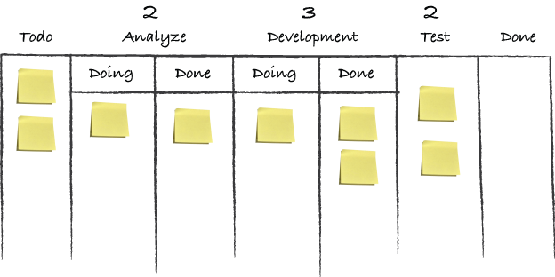
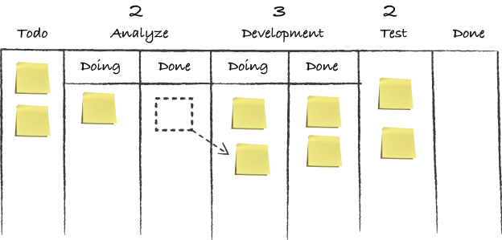
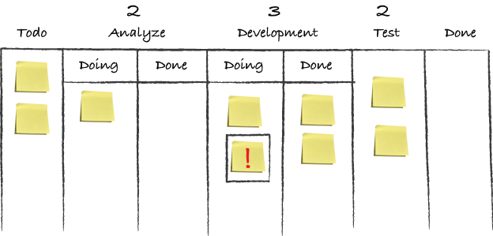
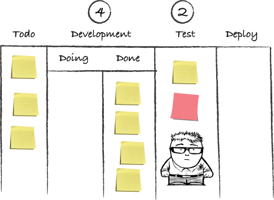

# Managing flow

*One-piece continuous flow* has been the cornerstone in Toyota's production vision.
This is a system in which each part of work that creates value for the customer moves from one value-adding step int the process directly to the next.
Things are produced only when needed, *just in time*.
This turns every process into a tightly linked chain in which everything is connected; so, when things break, you immediately know what's happened, and you're forced to solve the problem together.

## Why flow

If one-piece continuous flow is achieved, you have no delays, no queues, no batches, no inventory, no waiting.
That gives you flexibility and responsiveness, better risk management, faster feedback leading to improve quality, increased predictability leading to increased trust, fewer expedite requests, and faster continuous delivery of value.
Flow also exposes improvement opportunities and provides you with a vision for your improvement efforts: faster flow.

### Eliminating waste

Toyota identified seven categories of waste that applied to manufacturing. Different industries have since then made similar categories of waste for their particular contexts.

### The seven wastes of software development

1. partially done work
2. extra features
3. relearning. Failing to remember mistakes you've made before and having to redo them is a great waste.
4. handoffs. When you hand work from one person to another, a lot of extra work is created in order to convey necessary information to the next person.
5. delays
6. tasks switching
7. defects

Don't become obsessed with removing waste; instead look at the ROTI (return of time invested).

## Helping the work to flow

You can take several different approaches to help the work to flow.

### Limiting work in process

Limiting WIP is an essential practice when it comes to keeping the work moving.

>There are types of work and situations for which the opposite is true: you strive to use your resources optimally.
Optimizing for flow over resource utilization is a strategy decision.

### Reducing waiting time

The first step is showing the work that is done and ready for the next state. This makes the waiting visible and signals to others that the work item is ready to be pulled.
It's often necessary to go outside of your workflow and you kanban board.

#### Ensuring that work is ready

This can be done by planning and breaking work down to minimize dependencies, maybe having external people or resources prepared and standing by so that you don't get blocked, or designing the work for collaboration.

>One of the best way to make sure you understand each other is to practice **specification by example**.
This means you write your specification in the form of acceptance criteria or concrete examples of how a feature will be used.
The feature will be complete when the example is fulfilled.

#### Making the work items smaller and similarly sized

Smaller work items reduce lead times and lower the amount of WIP.
If you can make the work items more similar in size, you'll get a more even flow and increased predictability, which in turn can help you build trust and avoid needing to expedite "special requests". It also removes the cost part of the equation because all work now is of the same cost, at least time-wise.

### Removing blockers

>The prime directive of agile development is to never be blocked.
A good agile developer never takes a step that stops his progress, or the progress of others.
This directive extends to all levels of the team and organization.
Never being blocked means you set up your development environment such that blockages don't happen...

You can save some task that are useful to do when you're blocked. Some teams even create special classes of services for this: that is, special work that you as a team see as important, but that may not be immediately important to other stakeholders.
A blocker is also an opportunity to learn how you can improve your work.
Some teams create the habit of always applying root-cause analysis to every blocker or issue that stops the flow, to learn and improve from the root cause of the problem.

#### Tracking blockers

If you put start and end date on the blockers, or put a dot on their stickies for every day they sit here, you can see how much of a work item's total cycle time is spent being blocked.

#### Swarming

People swarm around the issue to resolve it more quickly and to get back to the normal flow.

Some teams make this an explicit policy when they get blocked, or even when they find a defect.

### Avoiding rework

Sometimes a defect will escape from one state of the workflow, only to be found in later one. This causes the work item to move backward in the workflow, which increase the cycle time because it increases the amount of WIP.

One of the key principles of Lean software development is to *build quality in from the start*.
A good way to accomplish this is to invest in technical practices such as:

- pair programming
- test-driven development
- continuous integration
- test automation

Another important practice for building quality in is to minimize the time between introducing and fixing a defect. If the code is tested as soon as it's developed, and any defects are fixed immediately after they're found, you'll save time logging defects and won't have to spend so much time figuring out where they were introduced.

#### Value demand and failure demand

Demand on a system caused by failure to do something or do something right for the customer is *failure demand* for John Seddon.
You don't gain much by making failure demand flow faster; instead you want to eliminate as much failure demand as possible to make room for more value demand.
Finding out what the customer needs and values and delivering just that also builds quality in.

>One simle and useful practice is to start tracking and visualizing the failure demand. This can be done by putting a little red dot on each sticky that represents failure demand as it enters the board.

### Cross-functional teams

Striving to make teams cross-functional helps reduce waiting, makes avoiding and removing blockers easier, and can help avoid rework.

#### Feature teams vs component teams

A cross-functional team can be organized as a feature team, responsible for a certain feature from start to finish.
Organizing your teams by feature sits well with a kanban flow and can even be visualized on a common board as a separate swim lanes.

### SLA or lead-time target

Some teams find that their service-level agreements (SLAs) gives them a clear target to strive toward, and other teams like to set a target themselves to track their progress against.
This helps foster a mindset that time is  of the essence, to flow the work faster. It can also give you teh benefits of time-boxing.
**Time-boxing** is a simple technique that is used in many agile software development methods to manage risk and to focus on doing the things that matter most first.
Using time-boxing also makes you aware of how much time you're spending on a task and helps you avoid *gold plating*: continuing to work on a task past the point where the extra effort is worth the value it adds.

## Daily standup

The daily standup meeting was made popular in the software development community in the early agile years with methods such as Scrum and XP.
This doesn't means it's only when using those methods that a daily standup can prove useful.
Together with visualizing your workflow on a board, it's probably the practice that many teams get the most immediate effect from when they start using it.

### Common good practices around standups

There are a few general tips on how to succeed with standups.

#### A standup is short

Keep the meeting short: 5 - 15 minutes.
A short meeting pushes you into talking about what is important and makes you think about what can be discussed elsewhere.

#### A standup starts and ends on time

#### A standup is focused

Make sure your precious time together is well invested for everyone who comes to the meeting.

#### A  standup is regular

Conduct the standup at the *same time* and the *same place* every day.
This creates a rhythm to the day.

### Kanban practices around daily standup

#### Focus on the baton - not the runners

Kanban teams tends to focus on the work on the board rather than on the individual people in the team.
This can be contrasted with focusing on each person in the team, as in the Scrum practice of letting each person answer "the three questions":

- what did you do yesterday
- what are you going to do today
- do you have any impediments that hinder you from doing that

This is a good practice that makes everyone talk at the meeting but you might miss the opportunity to talk about the work at hand.
Most importantly the focus is on whether there are any problems in the flow, in your process, or with individual work items. It helps you understand that you're a team whose members help each other get the work done together.

#### Walk the board

Kanban teams often enumerate their work from right to left, starting from the Done column and moving upstream. This is to emphasize the *pull-principle*: you're pulling work to you, pulling features into production.

By enumerating the work on the board from right to left, this means we might not have time to talk about the far left. This might be ok because that work is also the furthest from being done.

#### Focusing on smells

The **smells** are the work items that are not following your policies.
Example of kanban board at one daily standup:

Things that the team saw and talked about in their daily standup:

- we have two items in the Urgent lane. Didn't our policy state that there could be only one in there?
- in the Done column, Eric is still working on work that is completed. We probably need to talk about that. Is that work done?
- in the Test column, we have exceeded our WIP limit of two. Breaking a WIP limit should at least trigger a discussion
- in the Test column, there's work that has been waiting a long time that no one is working on. This is indicate with dots. Is there a blocker we should escalate?
- take a look at all that work that is ready for test. There's a bottleneck building up before Test. Maybe it's better that the developers stop working to put more stuff into that queue and start helping Adam to test instead.
- Daphne is hoarding lot of items in the Development column. Is that ok? Why is she doing that?, Will that be a problem? Does she need help?
- in the Analyze column, there's some sort of Important indicator on the only work item that no one is working on. Why?

### Get the most out of your standup

#### Question of conscience

A great question to ask each other is "Is there anything you're working on that isn't on the board?".

#### Working on the wrong thing

One way to handle this is with different classes of service.

#### Not understand the work

For outsiders, the rules to which the work adheres can be difficult to follow.
Try to always find simpler ways to describe your work.

#### Spontaneous kaizen

When the daily standup ends you'll sometimes see some people around the board forming groups and starting to talk about the work that you mentioned during the meeting -> spontaneous improvement meeting. The team is starting to discuss and improve their work.
This kind of behavior should be encouraged. Offer help and encourage them to involve the people needed to clear out the problem or improve the situation if they want to.

At Spotify one team uses a great way to visualize that a question should be talked about more after the standup: the topic was written on a small sticky and stuck onto the person who wanted to talk about it.
Another way to create a constant improvement focus is to use the *Kanban kata* in the standups.

### Scaling standups

We have more than one team working together on the same product of project, and we need a way to coordinate the group of teams as well. How have other teams used kanban to do that?

It's much more difficult to keep a big meeting with a lot of participants short, focused, and energized, especially daily.

- what do you want to get out of this meeting?
- share team-to-team information, don't just report status again
- consider having a board for the big daily as well

## What should i be doing next

Example:

- a situation that Adam found himself in a couple of days ago:

- he should check whether there's any work going on in the Test column right now.
Adam can help Beth to finish another item.

- now there's no more work in the Test column, but there are two items stacked up in the Development/Done queue.
Adam and Beth could pull both of those items into testing. Or maybe they want to take the top-priority item firs and work together to keep teh WIP down and finish that faster.
In this sample, Beth and Adam each take one item and finish it:

Adam is now the sole tester, and he finds himself in a situation in which there's no other work to be worked on in his column.
Both Frank and Beth are working on one item each, but nothing is finished. As the developers finish their work, they won't have any new work to pull because the Analyze/Done queue is empty. This is a bottleneck that need your attention.
Maybe Adam can help out there.

He should resist the urge to pull new work that increases WIP and instead try to find other interesting work.
This kind of work can be one of those things that you've postponed for so long: getting that new server upgraded, cleaning up the databases in the staging environment, or finally updating the documentation of the old API. It should not be work that needs to go through the normal workflow.

- help the team members know what to do next to make the team more autonomous
- use explicit policies and visualizations
- rule of thumb:
  - finish work in process
  - look for bottlenecks and help to resolve them
  - pull new work, if WIP limit allows
  - find other interesting work
- slack is not bad: slack enables improvements

## Managing bottlenecks

The queues and the WIP limits works together to create a leading indicator of the problems in your workflow while you're experiencing them. They tell you where the bottlenecks.

Example: the board, at the beginning of the day, looks like this:

After a little while, the developers want to pull in new work. There's only one item in Development/Doing.
The developers pull a new work item from the Analyze/Done column:

But the Development column is already at maximum capacity.
We have a bottleneck in testing.

If we do nothing and just keep pulling new development work Test will be flooded with work sitting there waiting. This will increase the lead times of everything in the workflow.
We need to free up people to fix the problem.
In many cases, this will only be a short-term solution. If Test is a recurring bottleneck, it makes sense to work on a long-term solution such as hiring more testers or perhaps automating more of the testing.

### Theory of Constraints: a brief introduction

Is a management philosophy that is based around the idea that the throughput of all systems is limited by at least one constraint: a bottleneck that slows production.
That also means the constraint slows down the whole system.
Any improvement you do to help work to flow better through the constraint is an improvement for the whole system.
This is a solution most people intuitively think if when faced with a bottleneck: adding more people or machines, more training, better tools, and better technologies. These solutions are often difficult because they require an expensive investment that takes time to produce results.
Another, simpler, and less expensive, option is to exploit the bottleneck.

#### Discovering a bottleneck

Bottlenecks often reveal themselves by having work piling up in front of them and steps after the bottleneck being starved fot things to do.
In the board below, you can see that there's a lot of work waiting to be tested and nothing that is ready to be deployed.

The developers are blocked from pulling new work because that would break their WIP limit of four. All four development items are waiting to be tested.
The testing step in turn is up to its WIP limit of two and should not pull more work either.
The step after testing (Deploy) has nothing to do because no work is flowing from the testing step.

#### Exploiting a bottleneck

The bottleneck could be anywhere.

The Five Focusing Steps:

1. identify the constraint of the system
2. exploit the constraint to get the most out of it
3. subordinate all other work to support the exploitation of the constraint
4. elevate the constraint
5. rinse and repeat

Some things you can do to exploit a bottleneck:

- make sure the people / role that constitutes the bottleneck resource always have work to do
- build in quality to minimize the workload
- remove or at least limit interruptions
- remove impediments that hinder them in their work or leave them waiting
- carefully prioritize the bottleneck's work so that they always work on the most important tasks
- let them work at a steady pace by evening out the arrival rate of work

To make sure the testers always have work, try to divide the work items into small deliverables that can be tested individually.

A common anti-pattern we have seen is that testers working in non-agile environments expect to do the testing in batches at the end of iterations or releases. A lot of time is spent on preparing, planning, administration, and similar activities.
