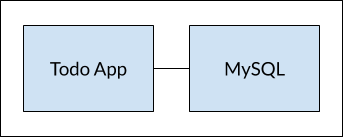

# Docker 101 Tutorial (sito ufficiale)

>[https://www.docker.com/101-tutorial](https://www.docker.com/101-tutorial)

## Play with Docker

Play with Docker is an interactive playground that allows you to run Docker commands on a linux terminal, no downloads required.

1. Log into [https://labs.play-with-docker.com/](https://labs.play-with-docker.com/) to access your PWD terminal
2. Type the following command in your PWD terminal:
docker run -dp 80:80 docker/getting-started:pwd
3. Wait for it to start the container and click the port 80 badge

### Getting started

#### The command you just ran

>docker run -dp 80:80 docker/getting-started:pwd

- -d run the container in detached mode
- -p 80:80 map port 80 of the host to port 80 in the container
- docker/getting-started is the image to use

#### What is a container

A container is simply another process on your machine that has been isolated from all other processes on the host machine.

#### What is a container image

The image contains the container's filesystem.

### Our Application

A simple todo list manager in Node.

#### Getting our App into PWD

We need to get the application source code into the Play with Docker environment.
For real projects, you can clone the repo. But, in this case, you will upload a [ZIP archive](img/app.zip).

In the PWD terminal, extract the zip file:

```bash
unzip app.zip
# change your current working directory
cd app/
# in this directory, you should see a simple Node-based application
ls
```

#### Building the App's Container Image

We need a **Dockerfile** (is simply a text-based script of instructions that is used to create a container image).

```docker
FROM node:10-alpine
WORKDIR /app
COPY . .
RUN yarn install --production
CMD ["node", "/app/src/index.js"]
```

Build the container image using the docker build command

```bash
docker build -t docker-101 .
```

#### Starting an App Container

Start your container using the docker run command

```bash
docker run -dp 3000:3000 docker-101
```

Open the application by clicking on the "3000" badge at the top of the PWD interface.

Go ahead and add an item or two and see that it works as you expect.

### Updating our App

#### Updating our Source Code

In the ~/app/src/static/js/app.js file, update line 56:

```html
- <p className="text-center">No items yet! Add one above!</p>
+ <p className="text-center">You have no todo items yet! Add one above!</p>
```

```bash
# let's build our updated version of the image
docker build -t docker-101

# let's start a new container using the updated code
docker run -dp 3000:3000 docker-101

# error: we aren't able to start the new container because our old container is still running
docker: Error response from daemon: driver failed programming external connectivity ...
```

#### Replacing our Old Container

To remove a container, it first needs to be stopped.

```bash
# get the ID of the container
docker ps

# stop the container
docker stop <the-container-id>

# remove the container
docker rm <the-container-id>

# start your updated app
docker run -dp 3000:3000 docker-101
```

### Sharing our App

#### Create a Repo on Docker Hub

1. Go on [Docker Hub](https://hub.docker.com/) and log in
2. Click the Create Repository button
3. Name: 101-todo-app, Visibility: Public
4. Click the Create button

#### Pushing our Image

In your PWD instance, ty running the command:

```bash
docker push dockersamples/101-todo-app
# result: The push refers to repository [docker.io/dockersamples/101-todo-app]
# An image does not exist locally with the tag: dockersamples/101-todo-app

# We need to tag our image

# login to the docker hub
docker login -u <YOUR-USER-NAME>

docker tag docker-101 <YOUR-USER_NAME>/101-todo-app

docker push <YOUR-USER-NAME>/101-todo-app
```

#### Running our Image on a New Instance

Add New Instance to PWD

```bash
# start your freshly pushed app
docker run -dp 3000:3000 <YOUR-USER-NAME>/101-todo-app
```

Click on the 3000

### Persisting our DB

#### The Container's Filesystem

When container runs, it uses the various layers from an image for its filesystem. Each container also gets its own "scratch space" to create / update / remove files. Any changes won't be seen in another container.

##### Seeing this in Practice

We're going to start two containers and create a file in each. The files created in one container aren't available in another.

```bash
# start a ubuntu container that will create a file named /data.txt with a random number between 1 and 10000
docker run -d ubuntu bash -c "shuf -i 1-10000 -n 1 -o /data.txt && tail -f /dev/null"

# validate we can see the output by exec'ing into the container
docker exec <container-id> cat /data.txt

# start another ubuntu container (from the same image) and we'll see we don't have the same file
docker run -it ubuntu ls /

# go ahead and remove the first container
docker rm -f <container-id>
```

#### Container Volumes

Each container is effectively read-only. While containers can create, update, and delete files, those changes are lost when the container is removed and are isolated to that container.
With volumes, we can change all of this.

[Volumes](https://docs.docker.com/storage/volumes/) provide the ability to connect specific filesystem paths of the container back to the host machine.

There are two main types of volumes.

#### Persisting our Todo Data (named volume)

**Named volumes** are great if we simply want to store data, as we don't have to worry about where the data is stored.

The todo app stores its data in a SQLite Database at /etc/todos/todo.db.

With the database being a single file, if we can persist that file on the host and make it available to the next container, it should be able to pick up where the last one left off. By creating a volume and attaching it to the directory the data is stored in, we can persist the data.

```bash
# create a volume (named = todo-db)
docker volume create todo-db

# start the todo container, but add the -v flag to specify a volume mount
docker run -dp 3000:3000 -v todo-db:/etc/todos docker-101

# add items
# remove container for todo app
docker rm -f <container-id>

# start a new container
docker run ...

# open the app: you items still in you list
# remove the container
```

#### Diving into our Volume (named)

If you want to know where Docker actually storing you data, you can use docker volume inspect:

```bash
docker volume inspect todo-db
# result:
[
    {
        "CreatedAt": "2020-06-09T07:11:52Z",
        "Driver": "local",
        "Labels": {},
        "Mountpoint": "/var/lib/docker/volumes/todo-db/_data",
        "Name": "todo-db",
        "Options": {},
        "Scope": "local"
    }
]
```

The Mountpoint is the actual location on the disk where the data is stored.

### Using Bind Mounts

With bind mounts, we control the exact mountpoint on the host. We can use this to persist data, but is often used to provide additional data into containers. When working on an application, we can use a bind mount to mount our source code into the container to let it see code changes, respond, and let us see the changes right away.

#### Quick Volume Type Comparisons

|       | Named Volumes | Bind Mount |
| ----- | ------------- | ---------- |
| Host Location | Docker chooses | You control |
| Mount Example (using -v) | my-volume:/usr/local/data | /path/to/data:/usr/local/data |
| Populates new volume with container contents | Yes | No |
| Supports Volume Drivers | Yes | No |

#### Starting a Dev-Mode Container

To run our container to support a development workflow, we will do the following:

- mount our source code into the container
- install all dependencies, including the "dev" dependencies
- start nodemon (for Node.js) to watch for filesystem changes

```bash
# make sure you don't have any previous docker-101 containers running
# run (from app directory)
docker run -dp 3000:3000 \
    -w /app -v $PWD:/app \
    node:10-alpine \
    sh -c "yarn install && yarn run dev"
# -w /app sets the working directory

# watch the logs
docker logs -f <container-id>
```

Make a change to the app. In the src/static/js/app.js file, change the "Add Item" button to simply say "Add".

Simply refresh the page and you should see the change.

Feel free to make any other changes you'd like to make.

Stop the container and build your new image using

docker build -t docker-101 .

Using bind mounts is very common for local development setups.

### Multi-Container Apps

We now want to add MySQL to the application stack. Where will MySQL run?
In general, **each container should do one thing and do it well**. A few reasons:

- there's good chance you'd have to scale APIs and front-ends differently than databases
- separate containers let you version and update versions in isolation
- while you may use a container for the database locally, you may want to use a managed service for the database in production
- running multiple processes will require a process manager which adds complexity to container startup/shutdown



#### Container Networking

If two containers are on the same network, they can talk to each other.

#### Starting MySQL

There are two ways to put a container on a network:

1. assign it at start
2. connect an existing container

```bash
# create the network
docker network create todo-app

# start a MySQL container and attach it the network
docker run -d \
    --network todo-app --network-alias mysql \
    -v todo-mysql-data:/var/lib/mysql \
    -e MYSQL_ROOT_PASSWORD=secret \
    -e MYSQL_DATABASE=todos \
    mysql:5.7

# connect to the database and verify it connects
docker exec -it <mysql-container-id> mysql -p
# type secret when the password prompt comes up
mysql> SHOW DATABASES;
```

#### Connecting to MySQL

How do we find the container if we run another container on the same network?

```bash
# start a new container using the nicolaka/netshoot image
docker run -it --network todo-app nicolaka/netshoot

# inside the container, we're going to use the dig command, which is a useful DNS tool. We're going to look up the IP address for the hostname mysql
dig mysql
```

Docker was able to resolve mysql hostname to the IP address of the container because it is a network alias.

#### Running our App with MySQL

The todo app supports the setting of a few environment variables to specify MySQL connection settings. They are:

- MYSQL_HOST - the hostname for the running MySQL server
- MYSQL_USER - the username to use for the connection
- MYSQL_PASSWORD - the password to use for the connection
- MYSQL_DB - the database to use once connected

>While using env vars to set connection settings is generally ok for development, it is HIGHLY DISCOURAGED when running applications in production.

```bash
# run app
docker run -dp 3000:3000 \
    -w /app -v $PWD:/app \
    --network todo-app \
    -e MYSQL_HOST=mysql \
    -e MYSQL_USER=root \
    -e MYSQL_PASSWORD=secret \
    -e MYSQL_DB=todos \
    node:10-alpine \
    sh -c "yarn install && yarn run dev"

# open the app in your browser and add few items
# connect to the mysql database and prove that the items are being written to the database
docker exec -ti <mysql-container-id> mysql -p todos

mysql> select * from todo_items;
```

### Using Docker Compose

Docker Compose is a tool that was developed to help define and share multi-container applications.
With Compose, we can create a YAML file to define the services and with a single command, can spin everything up or tear it all down.

The big advantage is you can define your application stack in a file, keep it at the root of your project repo, and easily enable someone else to contribute to your project. Someone would only need to clone your repo and start the compose app.

#### Installing Docker Compose

It is included with Docker Desktop / Toolbox for Windows or Mac. You will need to install Compose on Linux.

```bash
# after installation, you should be able to run the following
docker-compose version
```

#### Creating our Compose File

At the root of the app project, create a file named docker-compose.yml

```yaml
# it's best to use the latest supported version
version: "3.7"
# list of services (or containers) we want to run as part of our application
services:
  # defining the app service
  # FROM
  # docker run -dp 3000:3000 \
  # -w /app -v $PWD:/app \
  # --network todo-app \
  # -e MYSQL_HOST=mysql \
  # -e MYSQL_USER=root \
  # -e MYSQL_PASSWORD=secret \
  # -e MYSQL_DB=todos \
  # node:10-alpine \
  # sh -c "yarn install && yarn run dev"
  app:
    # the image for the container
    image: node:10-alpine
    command: sh -c "yarn install && yarn run dev"
    ports:
      - 3000:3000
    working_dir: /app
    volumes:
      - ./:/app
    environment:
      MYSQL_HOST: mysql
      MYSQL_USER: root
      MYSQL_PASSWORD: secret
      MYSQL_DB: todos
  # defining the MySQL Service
  # FROM
  # docker run -d \
  # --network todo-app --network-alias mysql \
  # -v todo-mysql-data:/var/lib/mysql \
  # -e MYSQL_ROOT_PASSWORD=secret \
  # -e MYSQL_DATABASE=todos \
  # mysql:5.7
  mysql:
    image: mysql:5.7
    # we need to define the volume in the top-level volumes: section and then specify the mountpoint in the service config
    volumes:
       - todo-mysql-data:/var/lib/mysql
    environment:
      MYSQL_ROOT_PASSWORD: secret
      MYSQL_DATABASE: todos

volumes:
  todo-mysql-data:
```

#### Running our Application Stack

1. make sure no other copies of the app/db are running first
2. start up the application stack using
docker-compose up -d
...
Creating app_app_1   ... done
Creating app_mysql_1 ... done
The volume was created as well as a network.
3. Look at the logs using
docker-compose logs -f

#### Tearing it All Down

Simply run:

docker-compose down

The containers will stop and the network will be removed.

### Image Building Best Practices

#### Image Layering

```bash
# see the command that was used to create each layer whithin an image
docker image history docker-101
```

#### Layer caching

>Once a layer changes, all downstream layers have to be recreated as well

We need to restructure our Dockerfile to help support the caching of the dependencies.

For Node-based applications, those dependencies are defined in the package.json file.

```docker
# From
# FROM node:10-alpine
# WORKDIR /app
# COPY . .
# RUN yarn install --production
# CMD ["node", "/app/src/index.js"]

# To
FROM node:10-alpine
WORKDIR /app
COPY package.json yarn.lock ./
RUN yarn install --production
COPY . .
CMD ["node", "/app/src/index.js"]
```

Build the Docker image.

Now make a change to the src/static/index.html

Build the Docker image. This time, your output should look a little different.
You should notice that the build was much faster.

#### Multi-Stage Builds

Advantages for the multi-stage build:

- separate build-time dependencies from runtime dependencies
- reduce overall image size by shipping only what your app needs to run

##### Maven / Tomcat Example

When building Java-based applications, a JDK is needed to compile the source code to Java bytecode.
However, that JDK isn't needed in production. Also, you might be using tools like Maven or Gradle to help build the app. Those also aren't needed in our final image. Multi-stage builds help.

```docker
FROM maven AS build
WORKDIR /app
COPY . .
RUN mvn package

FROM tomcat
COPY --from=build /app/target/file.war /user/local/tomcat/webapps
```

We use one stage (called build) to perform the actual Java build using Maven. In the second stage (starting FROM tomcat), we copy in files from the build stage. **The final image is only the last stage being created**.

##### React Example

When building React applications, we need a Node environment to compile the JS code (JSX), SASS stylesheets, and more into static HTML, JS, and CSS.

```docker
FROM node:10 AS build
WORKDIR /app
COPY package* yarn.lock ./
RUN yarn install
COPY public ./public
COPY src ./src
RUN yarn run build

FROM nginx:alpine
COPY --from=build /app/build /usr/share/nginx/html
```

Here, we are using a node:10 image to perform the build and then copying the output into an nginx container.

### What Next

#### Container Orchestration

Running containers in production is tough.
Container orchestration solves this problem. Tools like Kubernetes, Swarm, nomad and ECS all help solve this problem, all in slightly different ways.

The general idea is that you have "managers" who receive **expected state**. The managers watch for changes and then work to make **actual state** reflect the expected state.

#### Cloud Native Computing Foundation Projects

... is a vendor-neutral home for various open-source projects.
You can view the [graduate and incubated projects](https://www.cncf.io/projects/) and the entire [CNCF LAndscape](https://landscape.cncf.io/).
